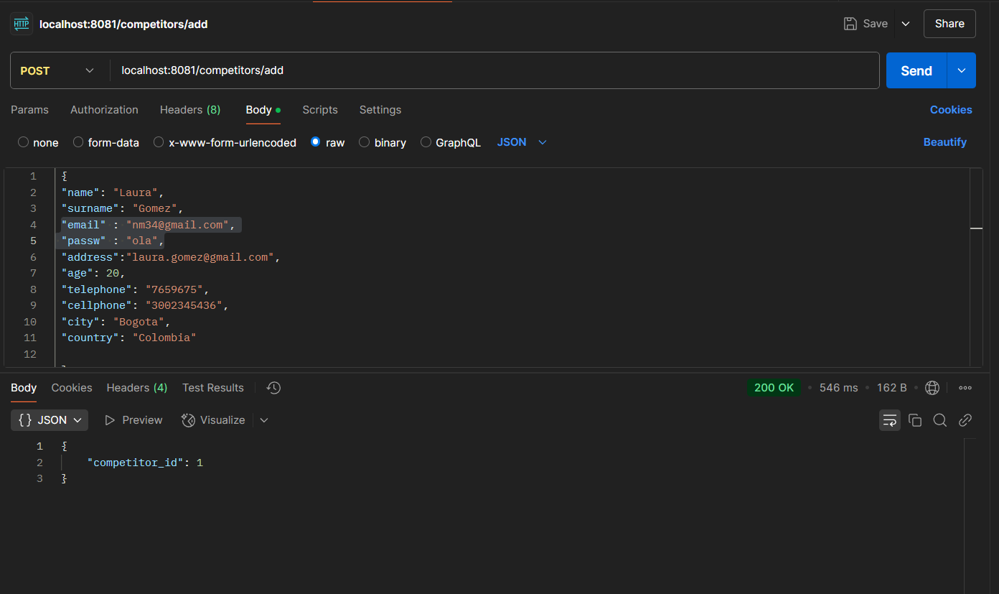
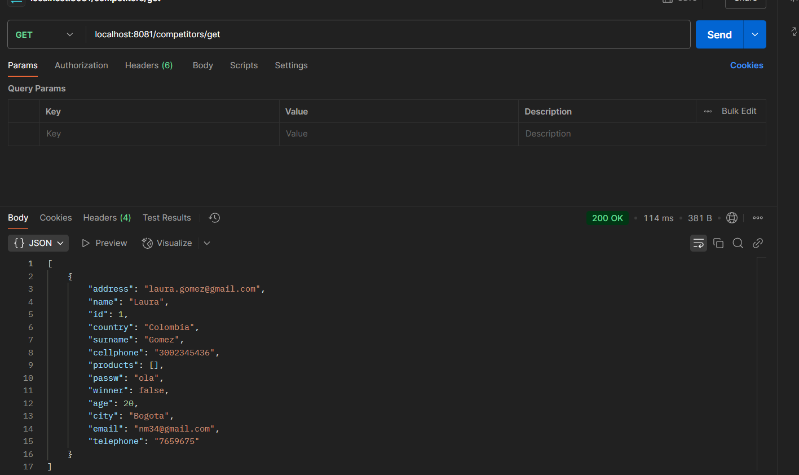
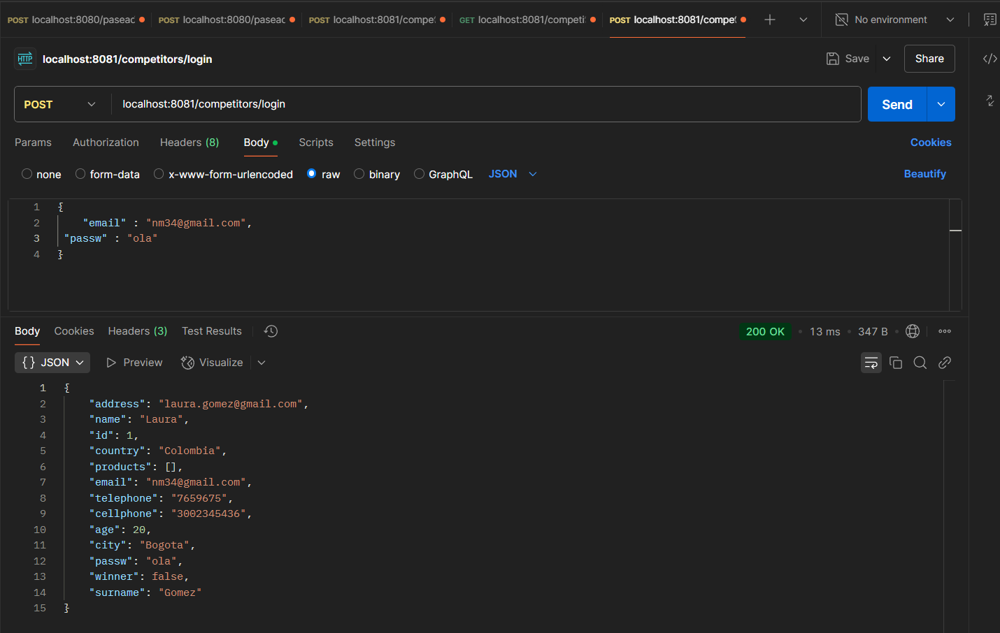
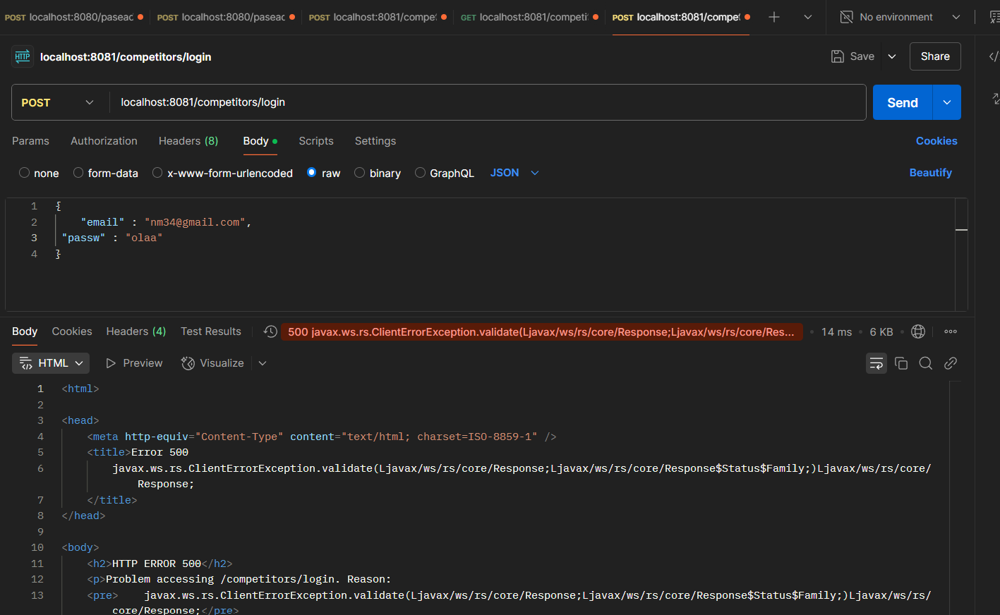

# JAX-RS Template Application

This is a template for a lightweight RESTful API using JAX-RS. The sample code is a call for getting the current time.
    
## Results

- Peticion para añadir un competidor

 

- Peticion para traer todos los competidores registrados

  

- Peticion para iniciar sesión (EXITOSA)

 

- Peticion para iniciar sesión (FALLIDA)

  

  **IMPORTANCIA DE USAR ONE TO MANY COMO RELACIÓN**

  Esta relación se crea para establecer una relacion en la base de datos de uno a muchos es decir un competidor tiene muchos productos esto se hace mediante una lista ya que la clase competidor tiene una lista o un set de productos asociados a un unico competidor, Tambien se usa el mappedBy para referenciar a el atributo de la clase a relacionar es decir, como estamos relacionando la clase competidor con productos, el atributo Set<Productos> productos de la clase competidor se mapea mediante el atributo competitor de la clase producto para asi crear la relación de uno a muchos, esto nos permite asociar un competidor a varios productos y hacer consultas de busqueda de produtos por competidor.
